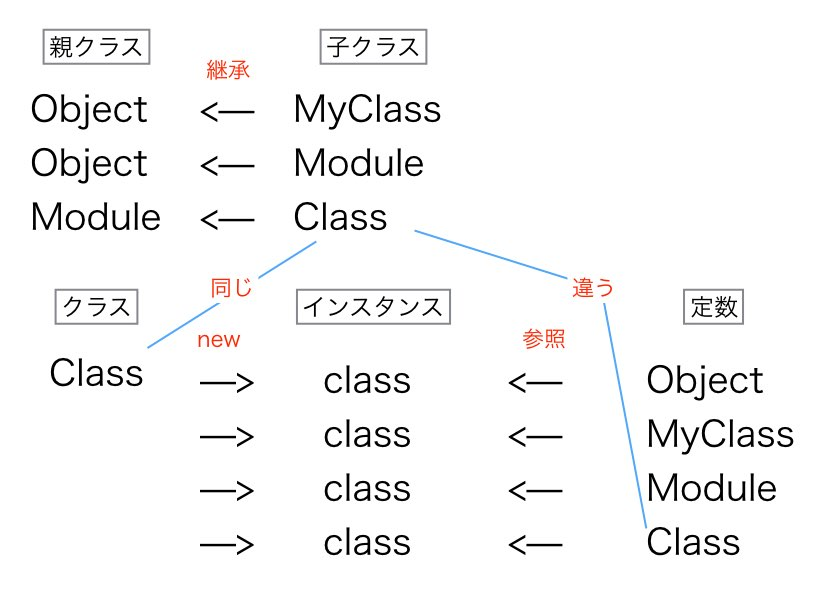
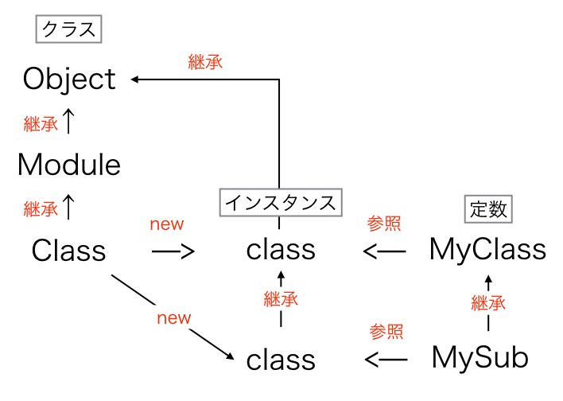

自作クラスの親クラスが`Module`でも`Class`でもなく`Object`であることが不思議に思えたので、`Object`, `Module`, `Class`の影響を調べてみました。これら3つの関係は下の通りです。





上記3クラスを拡張した場合、互いにどう影響するのでしょうか。

```ruby
class Object
  def self.object_class_method
    "object class method"
  end

  def object_instance_method
    "object instance method"
  end
end

class Module
  def self.module_class_method
    "module class method"
  end

  def module_instance_method
    "module instance method"
  end
end

class Class
  def self.class_class_method
    "class class method"
  end

  def class_instance_method
    "class instance method"
  end
end
```

拡張したメソッドが、各クラス、そのインスタンスから呼び出せるか表にまとめました。赤いマルとバツは自分が気になった部分です。


この結果からわかったことを記述していきます。

# `Class`クラスのインスタンスメソッドは全てのクラスメソッド

```ruby
Object.object_instance_method
Object.module_instance_method
Object.class_instance_method
```

`Object`, `Module`のインスタンスメソッドは子孫クラスの`Class`に引き継がれます。`Class`のインスタンスは他のクラスになり、全てのクラスで`object_instance_method`, `module_instance_method`が使えるようになります。`class_instance_method`が使える理由も同じです。

インスタンスメソッドが他のクラスのクラスメソッドになるのは、`Class`クラスのインスタンスが他のクラスになるからです。

```ruby
Foo = Class.new
# Class.new != Foo.new
```

```ruby
Module.object_instance_method
Module.module_instance_method
Module.class_instance_method
```

`Module`もクラスなので上記と同じ理由で`Class`のインスタンスメソッドをクラスメソッドとして呼び出すことが出来ます。

```ruby
Class.object_instance_method
Class.module_instance_method
Class.class_instance_method
```

こちらが少しややこしいです。全てのクラスは`Class`から出来ています。`Class`もクラスなので、`Class.new`と同じメソッドを持っていることになります。

`Class.class`で`Class`が得られることで、自分で自分自身を定義していることが分かります。

# `Class`のインスタンスメソッドは他のクラスのインスタンスから呼び出せない

```ruby
# 下記のメソッド呼び出しは`new`以外はエラーになります
object = Object.new
object.module_instance_method
object.class_instance_method

foo = Foo.new
foo.module_instance_method
foo.class_instance_method
```

このため、`Class`のインスタンスメソッドは他のクラスのインスタンスから呼び出す事ができません。`Class`クラスのインスタンス、つまりクラスからのみ呼び出すことが出来ます。

# `Class`クラスのクラスメソッドは、他のクラスに受け継がれない。

```ruby
Foo = Class.new
Foo.object_class_method


# 下記のメソッド呼び出しはエラー
Foo.module_class_method
Foo.class_class_method
```

クラスは親クラスを指定しない場合は、勝手に`Object`クラスが親となります。なので`Object`クラスのクラスメソッドが使えます。

`Module`クラスのクラスメソッドは、その子クラスの`Class`クラスのクラスメソッドとなります。クラスメソッドなので`Class.new`では使えません。`Class.new`はクラスであることは先述のとおりです。つまり、`Class`クラスのインスタンスメソッドは他のクラスに影響しますが、クラスメソッドは影響しません。影響するクラスメソッドは継承したクラスのものです。

# 自作クラスの親クラスは、`Module`でも`Class`でもなく`Object`である。

自作クラスの親クラスが`Object`になるのが不思議でした。`Module`や`Class`に追加したインスタンスメソッドが自作クラスにも影響がありますよね。これは`Module`や`Class`を継承しているからなのでは？と思いましたが違いました。その理由は下記のとおりです。

* `Class`のインスタンスメソッドが、自作クラスのクラスメソッドになる。
* 継承した場合は親のクラスメソッドは、子のクラスメソッドになる。

`Class`クラスが自作クラスに影響があるのは、継承ではなくクラス自体の仕様を変えているからです。上記2点のせいで少し勘違いをしてしまいました。
