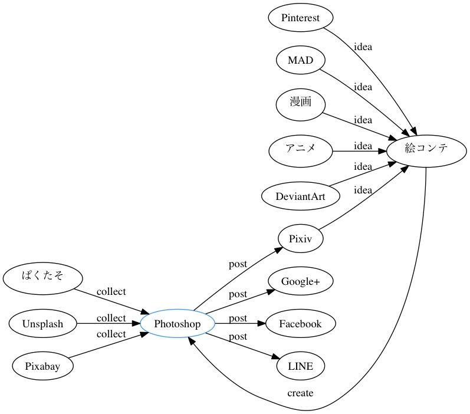

[Graphviz](http://www.graphviz.org/)というグラフ描画ツールを使ってみました。次のようなdotファイルというテキストから自動で作図してくれます。

```
// photoshop.dot
digraph sample {

graph [fontname = "NfMotoyaCedar", rankdir = LR];

// 青
"Photoshop" [color = "#3399ff"];

"Pinterest", "MAD", "漫画", "アニメ", "Pixiv", "DeviantArt" -> "絵コンテ" [label = "idea"];
"ぱくたそ", "Unsplash", "Pixabay" -> "Photoshop" [label = "collect"];
"絵コンテ" -> "Photoshop" [label = "create"];
"Photoshop" -> "Google+", "Pixiv", "Facebook", "LINE" [label = "post"];
}
```



# setup

brewで簡単にインストールできます。[出力フォーマットの種類はたくさんあります。](http://www.graphviz.org/doc/info/output.html)

```
brew install graphviz
vim photoshop.dot
dot -Tjpg photoshop.dot -o photoshop.jpg
```

# 参考サイト
公式以外だと次の2つが有益です。

* [Graphviz チュートリアル](http://homepage3.nifty.com/kaku-chan/graphviz/index.html)
* [Graphvizとdot言語でグラフを描く方法のまとめ - Qiita](http://qiita.com/rubytomato@github/items/51779135bc4b77c8c20d)

# どういう時に使うか？

> ここまでの説明で、がんばれば凝ったグラフを作成できることは分かって頂けたと思いますが、 VISIOとかで書いた方が楽じゃんと思った人もいるかもしれません …それは正しいです。  人がスクリプトをごりごり書くのではなく、下の図のようにプログラムで自動生成したdotスクリプトからグラフを自動生成というのがGraphvizの正しい使い方と思います。(たぶん)
>
> > <cite>[Graphvizによる有向グラフの自動生成 « Stop Making Sense](http://99blues.dyndns.org/blog/2010/01/graphviz/)</cite>

使ってみて実感しました。この通りだと思います。何度も同じ形式を使うわけじゃないなら、私はKeynoteを引き続き使っていこうと思います。自動生成が必要なときもレイアウトはKeynoteとかで先に決めたほうがいいかも。

単発で使うとしたらシンプルな関係図に留めたほうが効率がいいと思います。[アスキアートで作図してくれるgraph-easy](http://www.showa-corp.jp/special/graphtools/graph-easy.html)というのもあるみたいです。こちらもいいかもしれません。
